# HotelManagementSystem
A booking system for rooms.

Made with the code first database approach and repository design pattern.

# MVC (User system)

  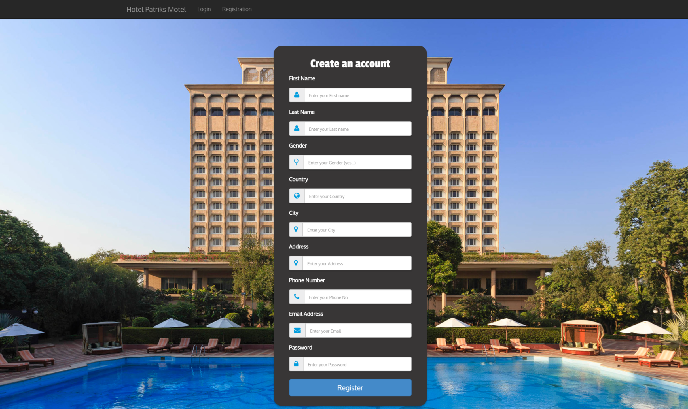
    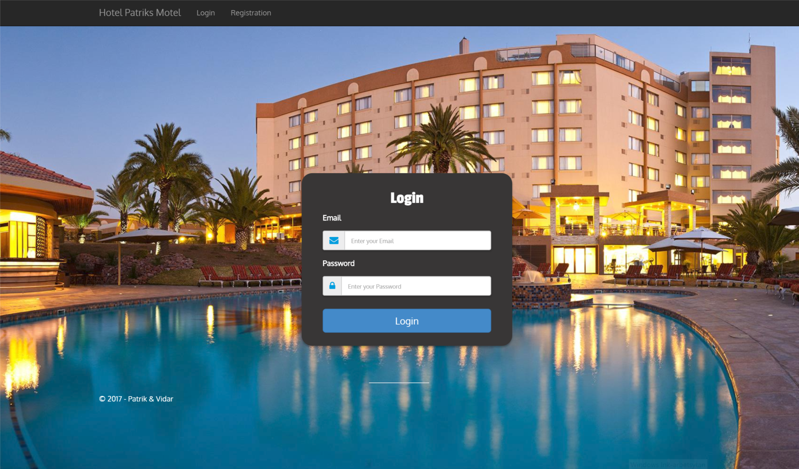
    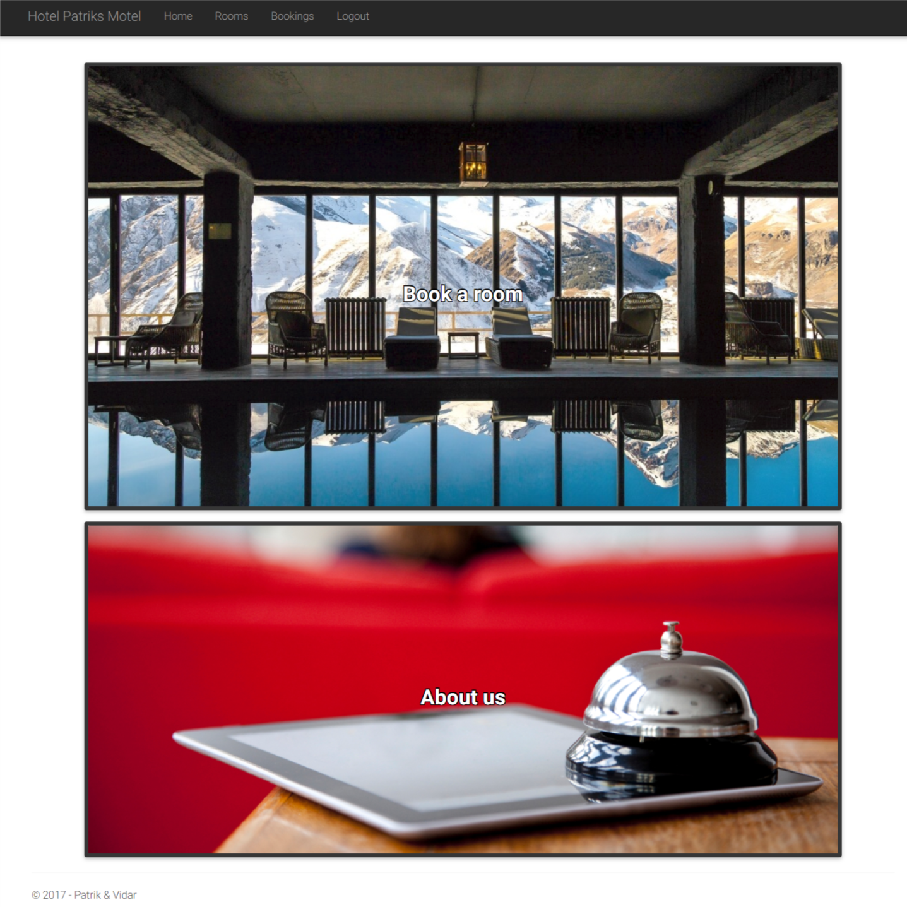
    
    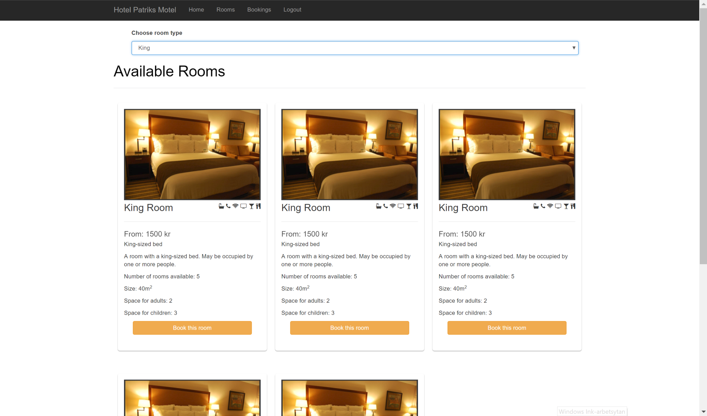
        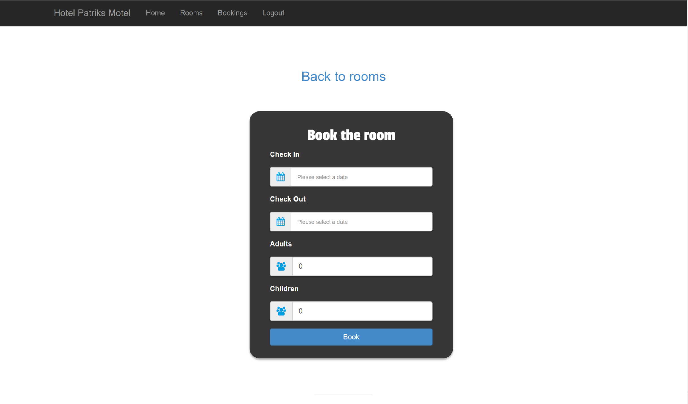
        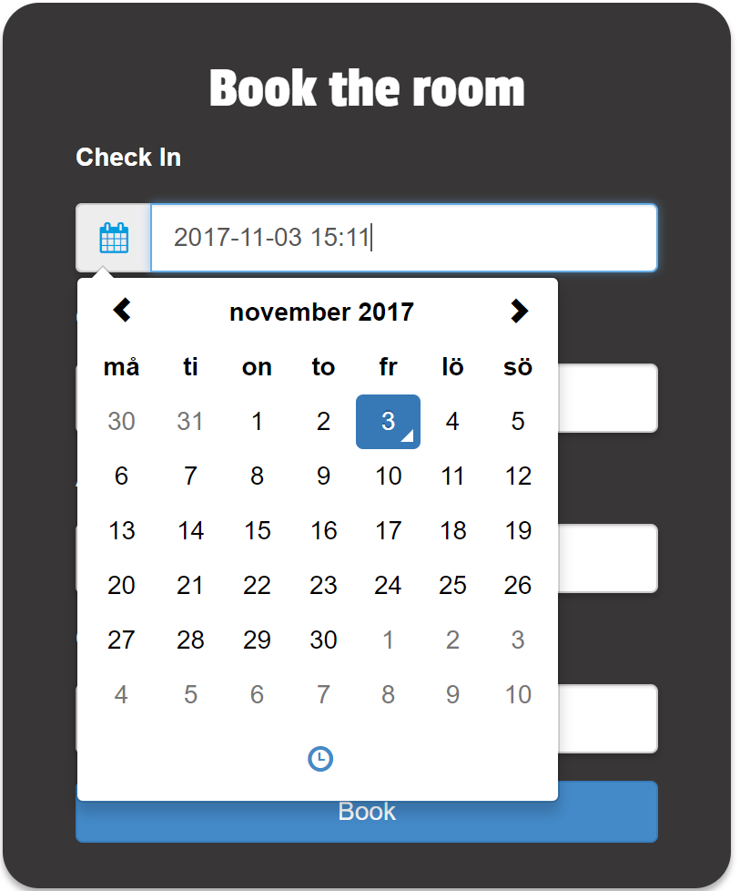
        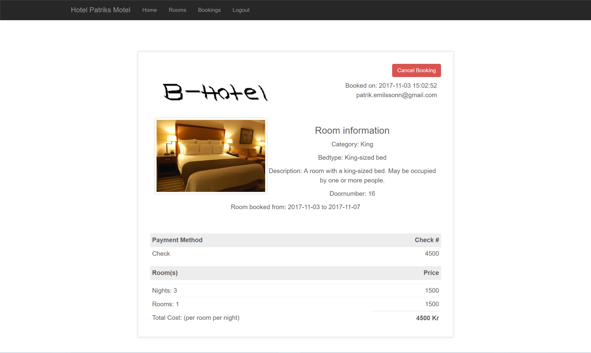

# MVC dataAnnotation Example

    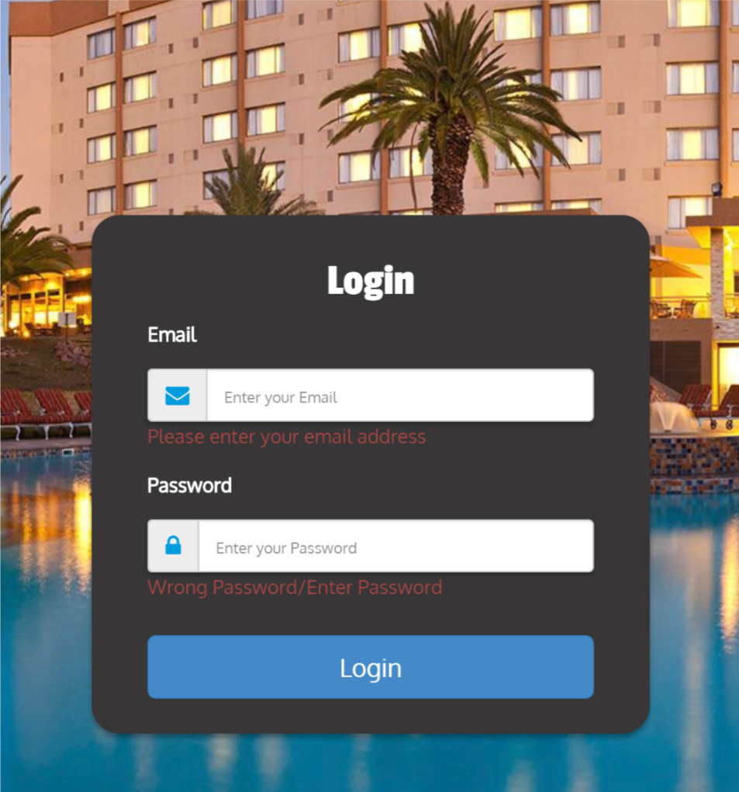

# UWP (Admin system)

  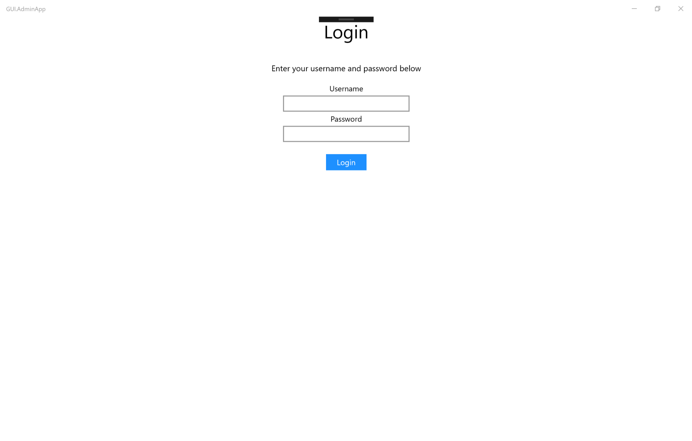
  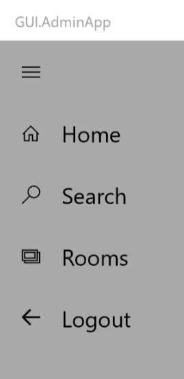
  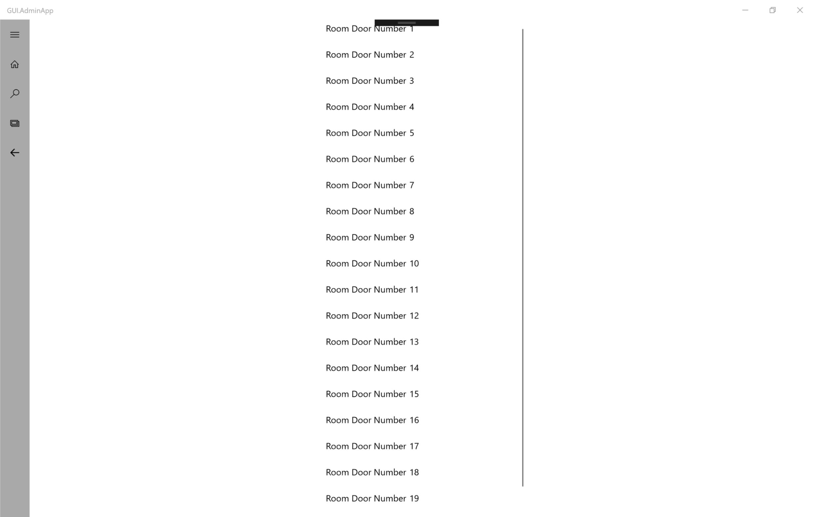
  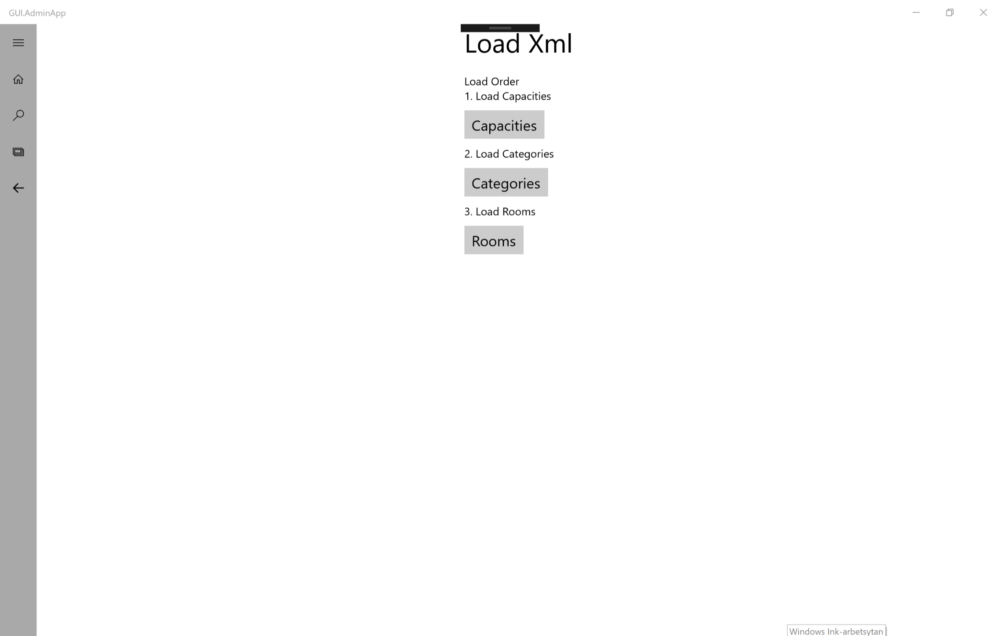
  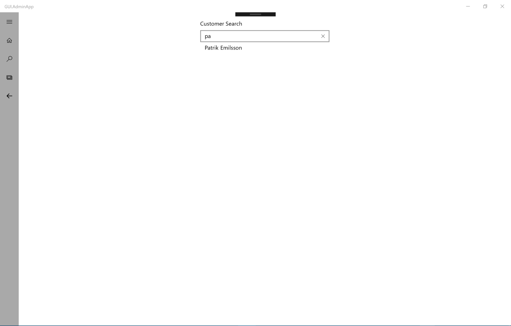
  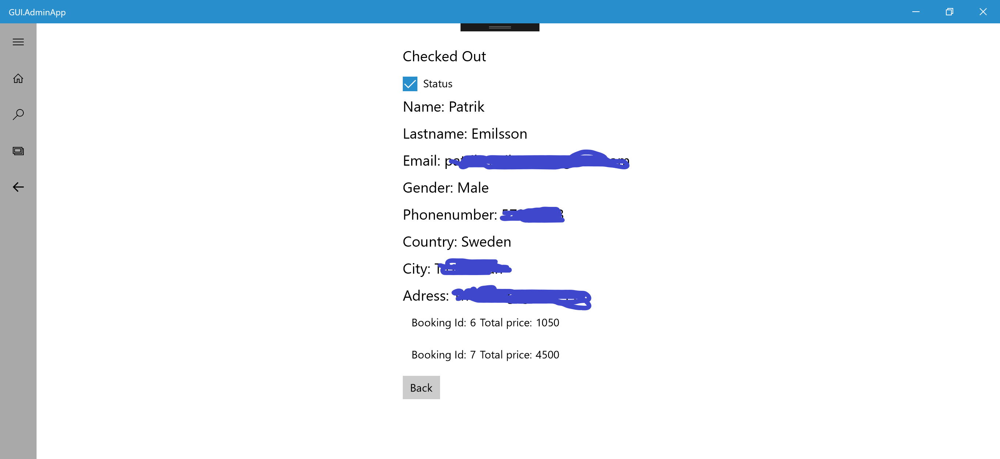
  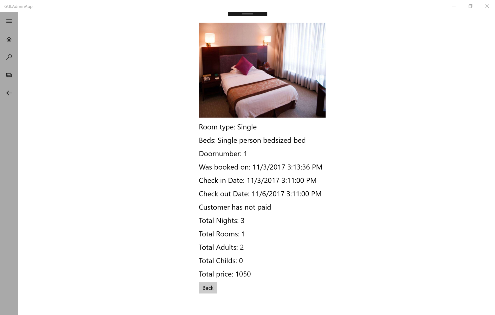

# Admin gets feedback checking out/in a customer one Example

  
  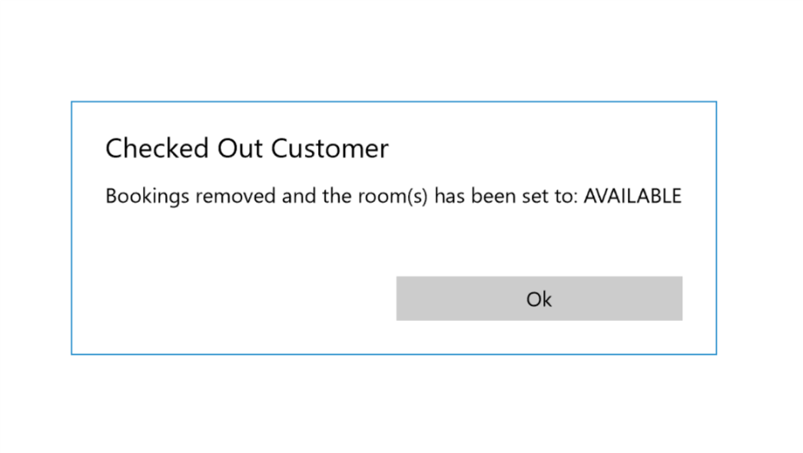

